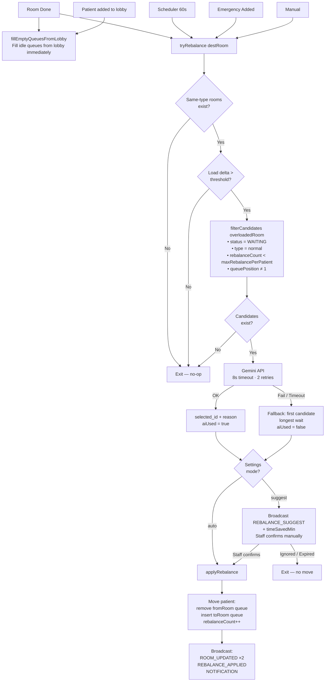

# Wellness Center POC

Queue management system with AI-assisted rebalancing.

## Stack

| Layer    | Tech                              |
|----------|-----------------------------------|
| Frontend | Next.js 16 + Tailwind             |
| Backend  | Bun + Hono + WebSocket            |
| AI       | Google Gemini 1.5 Flash           |
| Storage  | In-memory (resets on restart)     |

## Prerequisites

- [Bun](https://bun.sh) ≥ 1.3
- [Node.js](https://nodejs.org) ≥ 22 (for Next.js)
- [pnpm](https://pnpm.io) ≥ 8

---

## Setup

### 1. Install dependencies

```bash
# From repo root
pnpm install           # installs next-app deps

cd api
bun install            # installs api deps
cd ..
```

### 2. Configure API key

```bash
cp api/.env.example api/.env
```

Edit `api/.env`:

```env
GEMINI_API_KEY=your_google_gemini_api_key
PORT=3002
```

Get key: https://aistudio.google.com/app/apikey

> **Without key:** rebalance still works — falls back to "longest wait" selection. No AI reason shown.

---

## Run

Open **two terminals**.

**Terminal 1 — Backend**

```bash
cd api
bun run --hot index.ts
```

Runs on `http://localhost:3002`

**Terminal 2 — Frontend**

```bash
cd next-app
pnpm dev
```

Runs on `http://localhost:3001`

Open browser: `http://localhost:3001`

---

## What's seeded on start

| Room type  | Rooms | Avg duration |
|------------|-------|--------------|
| BMI Check  | 2     | 5 min        |
| Blood Test | 3     | 12 min       |
| Radiology  | 1     | 15 min       |

All rooms start idle. Add patients to populate.

---

## Quick demo flow

1. Click **+ Add Patient** → add 3–4 Normal patients
2. Add 1 Emergency — watch queue jump
3. Click **✓ Done** on a room → next patient auto-assigned
4. Fill up blood_test-1 queue (5 patients) → blood_test-2 or -3 triggers rebalance
5. Go to **Settings** → switch mode to `Suggest` → rebalance shows confirm card

---

## API reference

| Method | Endpoint                  | Description                    |
|--------|---------------------------|--------------------------------|
| GET    | `/api/rooms`              | All rooms grouped by type      |
| GET    | `/api/lobby`              | Lobby queue                    |
| POST   | `/api/patients/add`       | Add patient                    |
| POST   | `/api/done/:roomId`       | Mark current patient done      |
| POST   | `/api/rebalance/apply`    | Apply suggested rebalance      |
| GET    | `/api/settings`           | Get settings                   |
| POST   | `/api/settings`           | Update settings                |
| WS     | `ws://localhost:3002/ws`  | Realtime events                |

Full spec: [be.md](./be.md)

---

## Project structure

```
poc/
├── api/                    # Bun + Hono backend
│   ├── index.ts            # Entry, WebSocket
│   ├── store/state.ts      # In-memory state + seed
│   ├── engine/
│   │   ├── queue.ts        # Queue ops
│   │   ├── rebalance.ts    # Rebalance logic
│   │   ├── gemini.ts       # Gemini client (3s timeout)
│   │   └── scheduler.ts    # 60s periodic scan
│   ├── routes/             # REST endpoints
│   └── ws/broadcast.ts     # WebSocket manager
│
├── next-app/               # Next.js frontend
│   ├── app/
│   │   ├── page.tsx        # Dashboard
│   │   └── settings/       # Settings page
│   ├── components/
│   │   ├── dashboard/      # Room cards, lobby, notifications
│   │   └── settings/       # Settings panels
│   ├── hooks/
│   │   └── useRealtimeState.ts  # WS + REST state hook
│   └── lib/
│       ├── api-types.ts    # Backend response types
│       └── mock-data.ts    # FE display types
│
├── be.md                   # Backend spec
├── ui.md                   # UI spec
└── README.md
```

---

## Rebalance flow



## Notes

- State is **in-memory** — restart clears all patients and queues
- `rebalanceCount` resets on restart; configurable max via `maxRebalancePerPatient` setting
- `fillEmptyQueuesFromLobby` runs immediately on every lobby change — no 60s wait
- Settings changes apply to **new** routing decisions only; active patients unaffected
- Gemini call has **8s timeout** with 2 retries on 429 — always falls back gracefully
